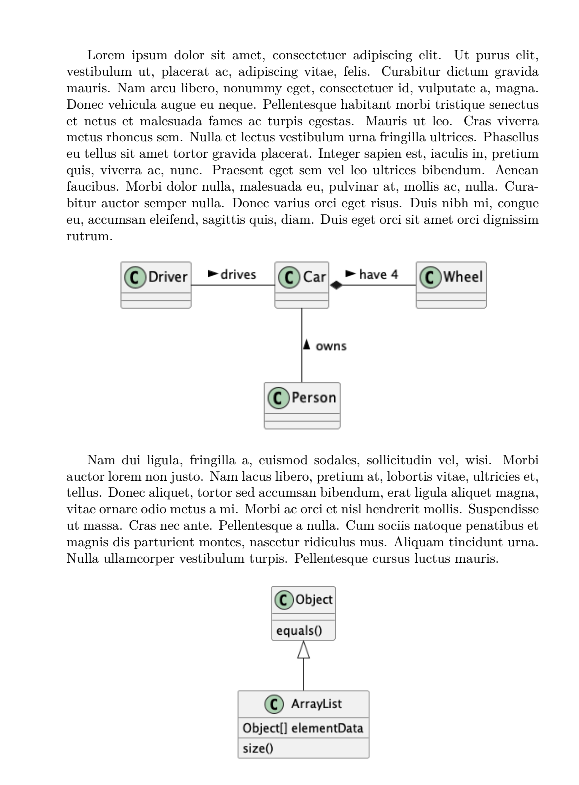

# plantuml.sty

LaTeX (XeLaXex) package to incorporate PlantUML code into LaTex files. This package does **NOT** require LuaText.

## Include inline

You can include directly PlantUML code in the LaTeX code:

```latex
\begin{plantuml}[width=0.8\textwidth]
@startuml
class Car

Driver - Car : drives >
Car *- Wheel : have 4 >
Car -- Person : < owns
@enduml
\end{plantuml}
```

## Include external file

You can include an external PlantUML file:

```latex
\plantumlinput[width=0.3\textwidth]{example}
```

Note: The file included is named `exemple.puml`. Do not specify the extension in the `plantumlinput` argument.

## Output



## Notes

* There is no need to enter words like `@startuml` and `@enduml` at the beginning of plantuml code
* The default resolution is 300 dpi
